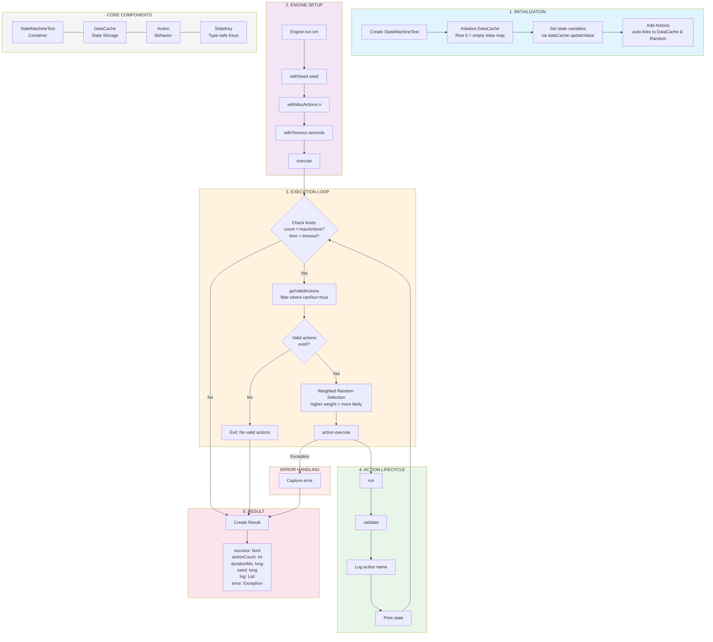
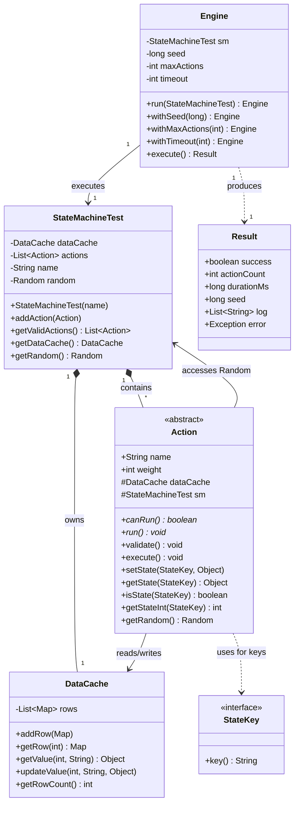
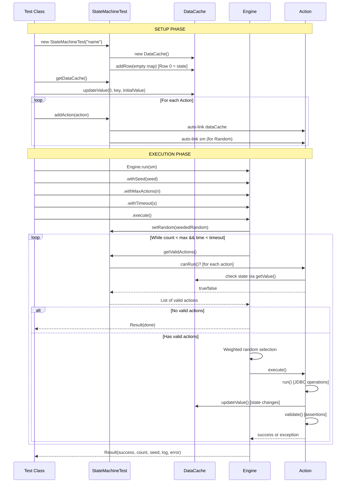

# State Machine Test Framework Diagrams

## 1. Execution Flowchart

## 2. Class Diagram

## 3. Sequence Diagram

## Component Summary

| Component | Purpose |
|-----------|---------|
| **StateMachineTest** | Container that owns DataCache, Actions, and seeded Random |
| **Engine** | Execution loop with weighted random action selection |
| **Action** | Abstract base with lifecycle: `canRun()` → `run()` → `validate()` |
| **DataCache** | Row 0 = state variables, Rows 1+ = test data |
| **StateKey** | Interface for type-safe state keys (implement as enum) |
| **Result** | Immutable execution result with seed for reproducibility |

## Design Patterns

- **Template Method**: Action's `execute()` calls `run()` then `validate()`
- **Builder**: Engine's fluent API (`withSeed()`, `withMaxActions()`, `withTimeout()`)
- **Strategy**: Actions define their own `canRun()` preconditions and `run()` behavior
- **Weighted Random**: Higher weight actions are more likely to be selected
