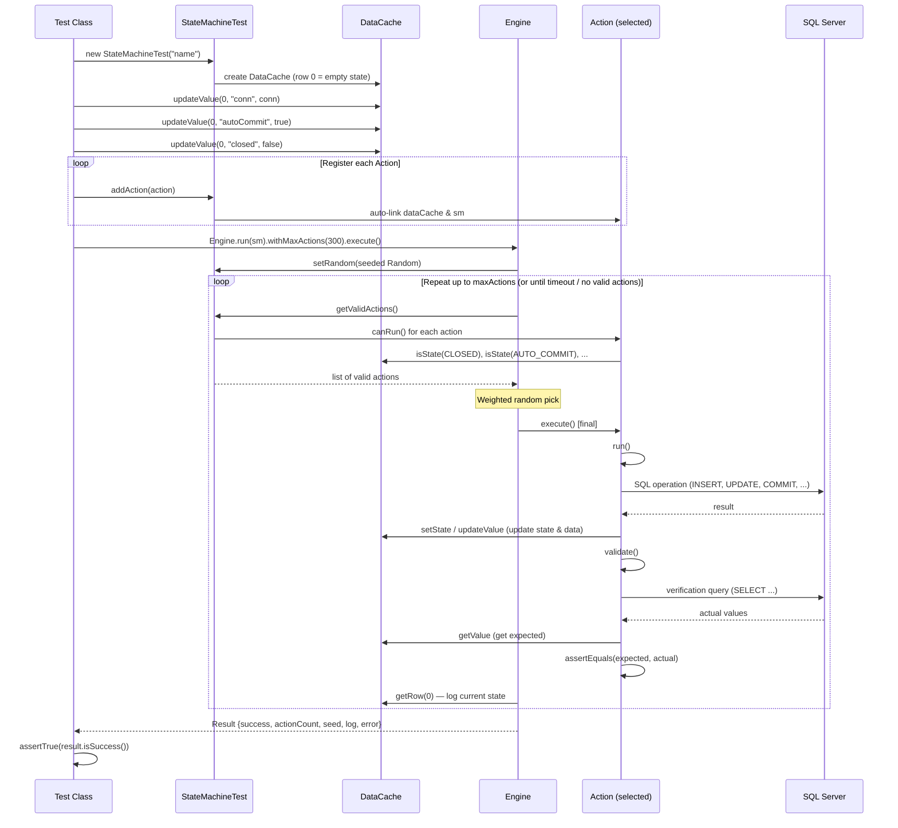

# State Machine Testing Framework

> **Audience:** PMs, Tech Leads, and Driver Team Engineers (Java, C#, C++, Python, Rust)  
> **Status:** Active — first implemented in MSSQL-JDBC; designed for adoption across all driver teams  

---

## 1. Background — Why This Framework Exists

### The Problem with Traditional Tests

Traditional JDBC driver tests look like this:

```
Test 1:  open → insert → commit → close          ✅ passes
Test 2:  open → insert → rollback → close         ✅ passes
Test 3:  open → insert → commit → insert → close  ✅ passes
```

Each test follows a **fixed, hand-written path**. Engineers only test the paths they can think of.  
But real applications do unexpected things:

```
open → insert → rollback → insert → commit → rollback → insert → commit → close
```

Nobody writes a test for that sequence — yet it's a perfectly valid usage pattern, and it may crash the driver.

### The Existing FX Framework (KoKoMo MBT)

MSSQL-JDBC already has the **FX Framework** — a Model-Based Testing (MBT) system built on top of the open-source **KoKoMo** library. FX/KoKoMo works well for automated action-path exploration: it defines models (e.g., `fxConnection`), states, and transitions, then uses KoKoMo's engine to randomly walk through valid transitions.

**What FX/KoKoMo does well:**
- Automatic exploration of state transitions
- Built-in model support for connection, statement, and resultset operations
- Proven approach for finding real-world bugs

**What makes FX/KoKoMo challenging:**
| Challenge | Impact |
|-----------|--------|
| **Debugging is hard** — KoKoMo uses internal scheduling, reflection, and annotation-driven execution | When a test fails, stepping through code in a debugger is difficult because the execution flow jumps across framework internals |
| **Reproducing failures is hard** — no built-in seed-based replay | A nightly test fails, but running it again produces a different random sequence; the bug disappears |
| **Framework complexity** — requires understanding KoKoMo's model DSL, annotations, and lifecycle | New team members and other driver teams (C#, C++, Python, Rust) face a steep learning curve |
| **Heavyweight dependency** — KoKoMo is a third-party Java library | Cannot be adopted by non-Java driver teams without rewriting the entire framework |

### The Goal: Simplified, Portable, Debuggable MBT

We wanted to keep the **power** of model-based testing (random exploration of valid state paths) while removing the **complexity** of KoKoMo. The result is this **State Machine Testing Framework** — a lightweight, self-contained system that:

1. **Any engineer can read and understand** in 30 minutes
2. **Any driver team can reimplement** in their language (the entire core is 6 classes, ~300 lines)
3. **Every failure is reproducible** — just save the seed number
4. **Debugging is trivial** — plain classes, no reflection, no annotations, no magic

---

## 2. Approach — How It Works (In Plain Language)

### The Core Idea

Instead of writing 20 fixed test cases, you tell the framework:

> *"Here are the 12 things a user can do with a transaction. Here are the rules for when each thing is valid. Now go run 300 random operations and tell me if anything breaks."*

Each run takes a **different random path** through the state space. Over hundreds of CI runs, the framework explores thousands of unique sequences — far more than any human could write by hand.

### Seed-Based Reproducibility

Every random choice is driven by a **seed number**. The seed is like a recipe:

```
Seed 54321 always produces:  setAutoCommit(false) → insert → commit → rollback → insert → ...
Seed 99999 always produces:  next → previous → first → getString → last → ...
```

When a test fails in CI:
1. The log prints the seed number (e.g., `Seed: 54321`)
2. You paste that seed into the test via `withSeed(54321)`
3. You get the **exact same sequence**, every time, on any machine
4. You set a breakpoint and step through — the bug reproduces on the first try

This is a significant improvement over FX/KoKoMo, where reproducing a random failure often requires multiple attempts or manual investigation.

### Fuzziness and Chaos Scenarios

The framework introduces **controlled chaos** through two mechanisms:

**1. Weighted Randomness (Fuzz)**  
Actions have different weights — `commit` (weight 30) is picked 10× more often than `duplicateKeyInsert` (weight 3). This means the framework naturally spends more time in high-risk operations, mimicking real-world usage. But low-weight actions still fire, creating unusual combinations.

**2. Non-Deterministic Valid Action Sets (Chaos)**  
At each step, only actions whose preconditions are satisfied can run. As the state changes, different actions become valid or invalid. The framework doesn't follow a fixed graph — it reacts to whatever state the system is in right now.

For example, after calling `setAutoCommit(false)`, both `commit()` and `rollback()` become valid. After `rollback()`, the data is back to its original state, which means a `SELECT` might return surprising results depending on earlier operations. These chaotic intersections are exactly where bugs hide.

```
Step 1:  [valid: setAutoCommit(false), insert, select, batchInsert]     → picks insert
Step 2:  [valid: setAutoCommit(false), insert, select, ...]             → picks setAutoCommit(false)
Step 3:  [valid: commit, rollback, insert, select, savepoint, ...]      → picks rollback
Step 4:  [valid: commit, rollback, insert, select, savepoint, ...]      → picks savepoint
Step 5:  [valid: commit, rollback, insert, rollbackToSavepoint, ...]    → picks commit
   ...
```

No human would write this exact sequence. But the framework does — and it might find a bug.

### Validation After Every Action — The `validate()` Hook

Each action can optionally define a `validate()` method that runs **immediately after** the action's `run()` method. This creates a continuous assertion loop:

```
run()       → INSERT id=5 val=42 into the real database
validate()  → SELECT id=5 → assert value == 42
```

The framework enforces this via the Template Method Pattern: the final `execute()` method calls `run()` then `validate()`. This design ensures **every single step** is verified — not just the end state.

### Debuggability — The #1 Design Goal

| Feature | FX / KoKoMo | This Framework |
|---------|--------------|----------------|
| Set a breakpoint in an action | Hard — execution flows through framework internals | Easy — plain `run()` method |
| Step through action selection | Hard — internal scheduler + reflection | Easy — simple `for` loop in Engine |
| Read the action code | Annotations + model DSL | Plain classes with `canRun()`, `run()`, and `validate()` |
| Understand execution flow | Requires framework knowledge | Reads like a `while` loop picking random items |
| Reproduce a failure | Re-run and hope for the same path | Paste the seed, get the same path every time |

---

## 3. Architecture — The Six Building Blocks

```
┌─────────────────────────────────────────────────────────────────────────────┐
│                              Test Class                                      │
│  (e.g., TransactionStateTest)                                                │
│  - Creates a connection to the real database                                 │
│  - Creates StateMachineTest (which internally owns a DataCache)              │
│  - Populates initial state in DataCache row 0                                │
│  - Registers all actions (auto-linked to DataCache)                          │
│  - Calls Engine.run(sm).withMaxActions(300).execute()                        │
│  - Asserts result.isSuccess()                                                │
└─────────────────────────────────┬───────────────────────────────────────────┘
                                  │ creates & configures
                                  ▼
┌──────────────────────────────────────────────────────────────────────────────┐
│                           StateMachineTest                                    │
│  Container: owns a DataCache, registered Actions, and a seeded Random         │
│  Row 0 of DataCache = shared state; rows 1+ = expected test data              │
│  addAction() auto-links each Action to the DataCache and StateMachineTest     │
└────────────────┬──────────────┬────────────────────┬────────────────────────┘
     used by     │   owns       │                    │  manages
                 ▼              ▼                    ▼
┌──────────────────────┐ ┌──────────────┐ ┌──────────────────────────────────┐
│      Engine           │ │  DataCache    │ │       Action (×N)                │
│  The execution loop:  │ │  Row 0: state │ │  Each action = one operation     │
│  1. Get valid actions │ │  Row 1+: data │ │  - canRun(): precondition check  │
│  2. Weighted random   │ │  (expected    │ │  - run(): do the thing           │
│     pick              │ │   test rows)  │ │  - validate(): verify results    │
│  3. Call execute()    │ │               │ │  - weight: selection frequency   │
│  4. Repeat            │ │               │ │  - execute(): run() + validate() │
└──────────────────────┘ └──────────────┘ └──────────────────────────────────┘
                                                    │
                                      reads/writes  │
                                                    ▼
                                    ┌──────────────────────────────┐
                                    │  StateKey (functional iface)  │
                                    │  Lambda constants for keys    │
                                    │  e.g., () -> "conn"           │
                                    │       () -> "autoCommit"      │
                                    └──────────────────────────────┘
```

### Execution Sequence Diagram



---

## 4. Detailed Component Explanation

### 4.1 Action — The Heart of the Framework

An **Action** represents one thing a user can do. For the Transaction test, the actions include `commit()`, `rollback()`, `setAutoCommit(false)`, `insert()`, `executeUpdate()`, `delete()`, `batchInsert()`, `savepoint()`, and more.

Every action answers three questions:

| Question | Method | Purpose |
|----------|--------|---------|
| **"Can I run right now?"** | `canRun()` | Checks if the current state makes this action valid. For example, `commit()` can only run when `autoCommit` is `false` and the connection is not `closed`. If `canRun()` returns `false`, the engine skips this action for this step. |
| **"What do I do?"** | `run()` | Performs the actual operation on the real system (e.g., calls `connection.commit()` on a real database) and then updates the state so the next action sees the correct state. |
| **"Did it work?"** | `validate()` | Optional verification hook — queries the database to confirm the operation's effect matches expectations. Called automatically after `run()`. Default is no-op. |

The framework enforces the lifecycle via the **Template Method Pattern**:

```
execute()   [final — called by Engine, not overridable]
  └── run()       [abstract — your operation logic]
  └── validate()  [optional — your verification logic]
```

Each action also has a **weight** — an integer that controls how often it gets selected. Think of it like putting more tickets in a raffle:

```
commit:               30 tickets   ← most transactions succeed (hot path)
executeUpdate:        25 tickets   ← price/quantity updates are frequent
insert:               20 tickets   ← new orders arrive frequently
setAutoCommit(false):  8 tickets   ← begin transaction
rollback:              5 tickets   ← occasional cancellations
select:                5 tickets   ← order lookups
batchInsert:           5 tickets   ← batch operations
savepoint:             4 tickets
setAutoCommit(true):   4 tickets
delete:                3 tickets   ← order removals are rare
duplicateKeyInsert:    3 tickets   ← error recovery testing
rollbackToSavepoint:   3 tickets   ← undo to savepoint
```

**State convenience methods on Action:**  
Actions access state through their linked DataCache (row 0) using convenience methods — no need to interact with DataCache directly:

| Method | What it does | Example |
|--------|-------------|---------|
| `setState(key, value)` | Write to state row | `setState(CLOSED, true)` |
| `getState(key)` | Read an object | `getState(CONN)` → returns the Connection |
| `isState(key)` | Read a boolean | `isState(AUTO_COMMIT)` → `true` or `false` |
| `getStateInt(key)` | Read an integer | `getStateInt(CURRENT_ROW)` → `3` |
| `getRandom()` | Get the seeded Random | `getRandom().nextInt(1000)` |
| `assertExpected(actual, expected, msg)` | Assert equality | Delegates to JUnit `assertEquals` |

Both `dataCache` and `sm` are auto-linked when the action is added via `StateMachineTest.addAction()`.

**Why `canRun()` matters:** Without preconditions, the framework would try to `commit()` when autoCommit is ON (which throws an exception). `canRun()` is the guard that keeps the framework from executing invalid operations. It encodes the **rules** of the API:

```
commit()              → only valid when autoCommit is OFF and connection is OPEN
rollback()            → only valid when autoCommit is OFF and connection is OPEN
getString()           → only valid when cursor is on a valid row and resultset is OPEN
savepoint()           → only valid when autoCommit is OFF and no active savepoint
rollbackToSavepoint() → only valid when autoCommit is OFF and a savepoint exists
```

These rules are exactly what the API specification says. By encoding them as `canRun()` checks, we create a **living specification** that is also a test.

**Minimal example (pseudocode — applicable to any language):**

```
Action: "commit"
  weight: 30
  canRun:    NOT closed AND NOT autoCommit
  run:       connection.commit(); promoteAllPending()
  validate:  SELECT all rows → assert DB matches expected cache
```

This is language-agnostic. A C# team writes this in C#. A Python team writes it in Python. The logic is the same.

### 4.2 StateKey — Type-Safe State Variables

The state machine tracks variables like "is the connection closed?" or "is autoCommit on?" These variables are stored in DataCache row 0 as a key-value map.

**The problem with string keys:**  
If you use raw strings (`"conn"`, `"closed"`, `"autocommit"`), a typo like `"autoComit"` silently creates a new key and the test passes incorrectly.

**The solution — StateKey constants:**  
Each test class defines its own `StateKey` constants as lambda instances of the `StateKey` functional interface. The constant names provide compile-time safety — a typo in the variable name won't compile:

```java
// In TransactionStateTest:
private static final StateKey CONN = () -> "conn";
private static final StateKey AUTO_COMMIT = () -> "autoCommit";
private static final StateKey CLOSED = () -> "closed";

// In ResultSetStateTest:
private static final StateKey RS = () -> "rs";
private static final StateKey CLOSED = () -> "closed";
private static final StateKey ON_VALID_ROW = () -> "onValidRow";
private static final StateKey CURRENT_ROW = () -> "currentRow";
```

The `StateKey` interface is a functional interface with a single method: `key()` → returns the string used for DataCache storage. Using lambda constants keeps everything self-contained in the test class — no separate enum files needed.

**For non-Java teams:** Use whatever your language provides for named constants — C# enums, Python `Enum`, Rust `enum`, C++ `enum class`, or simple constants. The concept is the same: avoid raw strings for state keys.

### 4.3 DataCache — The Data Store

`DataCache` is the single source of truth for all state and expected test data. It stores an ordered list of rows, where each row is a `Map<String, Object>`:

- **Row 0:** State variables (keyed by `StateKey.key()`). For example: `{conn=..., autoCommit=true, closed=false, commitCount=0}`
- **Rows 1+:** Expected test data. For example: `{id=1, value=42, pendingValue=null, rowState="committed"}`

Key methods:

| Method | What it does | Example |
|--------|-------------|---------|
| `addRow(map)` | Add a new data row | `cache.addRow(row)` — adds expected row |
| `getRow(index)` | Get an immutable view of a row | `cache.getRow(0)` → state map |
| `getValue(index, key)` | Get one value | `cache.getValue(1, "id")` → `1` |
| `updateValue(index, key, val)` | Update one value | `cache.updateValue(0, "commitCount", 5)` |
| `getRowCount()` | Total rows | `cache.getRowCount()` → `11` (1 state + 10 data) |

`DataCache` is created internally by `StateMachineTest` with an empty row 0. Actions access it via the convenience methods on `Action` (`setState`, `getState`, etc.) or directly via `dataCache` field for data rows.

#### Concrete Example — Row 0 vs Rows 1+

Imagine a Transaction test that has inserted 3 orders, committed once, then inserted a 4th order (not yet committed). Here is what the DataCache looks like at that moment:

```
┌─────────────────────────────────────────────────────────────────────────────┐
│  ROW 0  —  State Variables (control flow; NOT a database row)               │
│  ┌─────────────┬────────────────┬───────────────┬──────────────┬─────────┐  │
│  │ conn        │ autoCommit     │ closed        │ commitCount  │ nextId  │  │
│  │ Connection  │ false          │ false         │ 1            │ 5       │  │
│  │ object      │                │               │              │         │  │
│  └─────────────┴────────────────┴───────────────┴──────────────┴─────────┘  │
│  Accessed via: setState(AUTO_COMMIT, false), isState(CLOSED), etc.          │
├─────────────────────────────────────────────────────────────────────────────┤
│  ROW 1  —  Expected data for order id=1                                     │
│  ┌────────┬────────────┬───────────────┬──────────────────┐                  │
│  │ id     │ value      │ pendingValue  │ rowState         │                  │
│  │ 1      │ 42         │ null          │ "committed"      │  ← in DB        │
│  └────────┴────────────┴───────────────┴──────────────────┘                  │
├─────────────────────────────────────────────────────────────────────────────┤
│  ROW 2  —  Expected data for order id=2                                     │
│  ┌────────┬────────────┬───────────────┬──────────────────┐                  │
│  │ id     │ value      │ pendingValue  │ rowState         │                  │
│  │ 2      │ 99         │ null          │ "committed"      │  ← in DB        │
│  └────────┴────────────┴───────────────┴──────────────────┘                  │
├─────────────────────────────────────────────────────────────────────────────┤
│  ROW 3  —  Expected data for order id=3                                     │
│  ┌────────┬────────────┬───────────────┬──────────────────┐                  │
│  │ id     │ value      │ pendingValue  │ rowState         │                  │
│  │ 3      │ 77         │ null          │ "committed"      │  ← in DB        │
│  └────────┴────────────┴───────────────┴──────────────────┘                  │
├─────────────────────────────────────────────────────────────────────────────┤
│  ROW 4  —  Expected data for order id=4  (just inserted, not committed)     │
│  ┌────────┬────────────┬───────────────┬──────────────────┐                  │
│  │ id     │ value      │ pendingValue  │ rowState         │                  │
│  │ 4      │ 55         │ null          │ "pending_insert" │  ← uncommitted  │
│  └────────┴────────────┴───────────────┴──────────────────┘                  │
└─────────────────────────────────────────────────────────────────────────────┘
```

**What happens next depends on the random engine pick:**

| Next action | Effect on Row 0 | Effect on Rows 1–4 |
|-------------|-----------------|---------------------|
| **commit** | `commitCount` → 2 | Row 4: `rowState` → `"committed"` |
| **rollback** | `rollbackCount` + 1 | Row 4: `rowState` → `"removed"` (INSERT undone) |
| **executeUpdate** | (no change) | A random committed row's `pendingValue` set to new value |
| **insert** | `nextId` → 6 | New Row 5 added with `rowState = "pending_insert"` |
| **savepoint** | `savepointSnapshot` = copy of rows 1–4 | (no change — snapshot saved for future rollback-to-savepoint) |

**Key insight:**  
- **Row 0** is never sent to the database — it tracks *control state* (is the connection open? are we in a transaction?).  
- **Rows 1+** mirror what we *expect* the database to contain. After every action, `validate()` queries the real database and asserts it matches these rows.  
- This separation lets the framework predict the exact database state after any random sequence of commits, rollbacks, inserts, updates, and deletes.

### 4.4 StateMachineTest — The Container

`StateMachineTest` is the central container that ties everything together. It:

- **Owns the DataCache** — created in the constructor with an empty state row (row 0)
- **Manages registered actions** — `addAction()` auto-links each action to the DataCache and the StateMachineTest instance
- **Provides the seeded Random** — set by the Engine before execution; actions access it via `getRandom()`

Key methods:

| Method | What it does | Example |
|--------|-------------|---------|
| `getDataCache()` | Access the underlying DataCache | `sm.getDataCache().updateValue(0, "conn", conn)` |
| `addAction(action)` | Register and auto-link an action | `sm.addAction(new CommitAction(30))` |
| `getValidActions()` | Get all actions whose `canRun()` is true | Used internally by the Engine |
| `getRandom()` | Get the seeded Random | `sm.getRandom().nextInt(100)` |

**Note:** State mutation is done through `Action` convenience methods (`setState`, `getState`, `isState`, `getStateInt`), which read/write DataCache row 0. `StateMachineTest` itself does not provide state mutation methods — it is simply the container.

### 4.5 Engine — The Execution Loop

The Engine is the simplest part. In plain language, it does this:

```
1.  Set up the random number generator with the given seed
2.  Link the seeded Random to StateMachineTest (so actions can use it)
3.  REPEAT up to maxActions times (default 500) or until timeout (default 30s):
      a.  Ask the state machine: "Which actions can run right now?"
      b.  If no actions can run → stop
      c.  Pick one action randomly (weighted by action weights)
      d.  Call action.execute() → runs run() then validate()
      e.  Log which action was executed and print the state map
4.  If any action threw a Throwable (including AssertionError) → report failure
5.  Return a Result with: success/fail, action count, seed, duration, log
```

The entire Engine is a single `while` loop. There is no scheduler, no thread pool, no reflection, no annotation processing. You can set a breakpoint on any line and step through.

The Engine catches `Throwable` (not just `Exception`) to capture JUnit `AssertionError` from `validate()` hooks.

**Builder-style configuration:**

```java
Engine.run(sm)
    .withSeed(54321)       // optional — default: System.currentTimeMillis()
    .withMaxActions(300)   // optional — default: 500
    .withTimeout(60)       // optional — default: 30 seconds
    .execute();
```

**Sample console output from a real run:**

```
ECommerceTransactions | Seed:1740567881946 | Max:300 | Timeout:30s
[  1] insert               | {conn=..., autoCommit=true, closed=false, commitCount=0, ...}
[  2] setAutoCommit(false)  | {conn=..., autoCommit=false, closed=false, commitCount=0, ...}
[  3] executeUpdate         | {conn=..., autoCommit=false, closed=false, commitCount=0, ...}
[  4] commit                | {conn=..., autoCommit=false, closed=false, commitCount=1, ...}
[  5] insert                | {conn=..., autoCommit=false, closed=false, commitCount=1, ...}
[  6] savepoint             | {conn=..., autoCommit=false, savepointSnapshot=[...], ...}
[  7] rollbackToSavepoint   | {conn=..., autoCommit=false, savepoint=null, ...}
  ...
[300] insert                | {conn=..., autoCommit=false, commitCount=58, rollbackCount=11, ...}
Done: 300 actions in 857ms
Result: actions=300, commits=58, rollbacks=11
```

Every step is visible. Every state is printed. If step 37 fails, you add `.withSeed(...)` with the logged seed and put a breakpoint at step 37's action.

### 4.6 Result — The Test Outcome

After the Engine finishes, it returns an immutable `Result` object containing everything you need:

| Field | Type | What it tells you |
|-------|------|-------------------|
| `success` | `boolean` | Did all actions complete without errors? |
| `actionCount` | `int` | How many actions were executed (may be less than max if engine stopped early) |
| `seed` | `long` | The seed used — **save this to reproduce the exact run** |
| `durationMs` | `long` | Wall-clock time for the entire run |
| `log` | `List<String>` (unmodifiable) | Ordered list of action names that were executed |
| `error` | `Throwable` | The error that caused the failure (null if success) |

All fields are `public final` — the Result is fully immutable.

---

## 5. End-to-End Example — How a Test Works

### Transaction Test (E-Commerce Simulation)

The Transaction test simulates an e-commerce order system: orders are inserted, prices updated, cancelled orders deleted — all within transactions that commit or rollback randomly.

```
1. JUnit calls TransactionStateTest.testRandomizedTransactions()

2. Test opens a real connection to SQL Server

3. Test creates a StateMachineTest (which internally creates a DataCache with empty row 0)

4. Test populates initial state in DataCache row 0:
      CONN           = the real Connection object
      AUTO_COMMIT    = true    (SQL Server default)
      CLOSED         = false   (connection is open)
      commitCount    = 0
      rollbackCount  = 0
      nextId         = 1
      savepoint      = null
      savepointSnapshot = null

5. Test registers 12 actions (as inner classes):
      insert                 weight=20   canRun: not closed
      setAutoCommit(false)   weight=8    canRun: not closed AND autoCommit is ON
      setAutoCommit(true)    weight=4    canRun: not closed AND autoCommit is OFF
      commit                 weight=30   canRun: not closed AND autoCommit is OFF
      rollback               weight=5    canRun: not closed AND autoCommit is OFF
      executeUpdate          weight=25   canRun: not closed AND has visible rows
      select                 weight=5    canRun: not closed AND has visible rows
      delete                 weight=3    canRun: not closed AND has visible rows
      duplicateKeyInsert     weight=3    canRun: not closed AND has visible rows
      batchInsert            weight=5    canRun: not closed
      savepoint              weight=4    canRun: not closed AND autoCommit OFF AND no active savepoint
      rollbackToSavepoint    weight=3    canRun: not closed AND autoCommit OFF AND savepoint exists

6. Test calls Engine.run(sm).withMaxActions(300).execute()

7. Engine loop (300 steps):
      Step 1:  autoCommit=true  → valid: [insert, setAutoCommit(false), batchInsert]
               picks insert → INSERT id=1, val=42 (auto-committed)
               validate → SELECT id=1 → confirms value=42 ✓
      Step 2:  picks setAutoCommit(false) → autoCommit becomes false
      Step 3:  picks insert → INSERT id=2, val=99 (pending)
               validate → SELECT id=2 → confirms value=99 (visible in same txn) ✓
      Step 4:  picks commit → all pending→committed
               validate → SELECT all rows → all match expected cache ✓
      Step 5:  picks savepoint → snapshot taken
      Step 6:  picks insert → INSERT id=3 (pending after savepoint)
      Step 7:  picks rollbackToSavepoint → id=3 undone, state restored to snapshot
               validate → SELECT all → matches snapshot ✓
      ...
      Step 300: done

8. Test asserts:
      - result.isSuccess() — all 300 steps passed
      - commitCount >= 3 — enough commits happened to exercise the path
```

### DataCache Row-State Tracking

The Transaction test tracks each data row's lifecycle through states:

| Row State | Meaning | After Commit | After Rollback |
|-----------|---------|-------------|----------------|
| `committed` | Row is permanently in the database | stays `committed` | stays `committed` |
| `pending_insert` | Row inserted but not yet committed | → `committed` | → `removed` |
| `pending_delete` | Row marked for deletion but not yet committed | → `removed` | → `committed` |
| `removed` | Row no longer in the database | (no change) | (no change) |

This enables the framework to predict exactly which rows should be visible at any point during the test, even across complex sequences of inserts, updates, deletes, commits, rollbacks, and savepoint operations.

---

## 6. Adopting This Framework in Other Driver Teams

This framework is designed to be **language-agnostic**. The core concepts are:

| Concept | What to implement | Complexity |
|---------|-------------------|------------|
| Key-value state/data store (DataCache) | A list of dictionaries / hashmaps | ~20 lines |
| Action base class | Abstract class with `canRun()`, `run()`, `validate()`, `execute()`, `weight` | ~30 lines |
| Engine loop | While loop with weighted random selection | ~40 lines |
| State key constants | Named constants or enums for type safety | ~5 lines |
| State machine container | Owns DataCache, action list, seeded Random | ~30 lines |
| Result | Simple immutable data class | ~15 lines |

**Total core framework: ~140 lines in any language.**

### What each team needs to do:

1. **Implement the core** (~140 lines) — one-time effort
2. **Define actions for your domain** — e.g., Transaction, ResultSet, Connection (as inner classes in the test)
3. **Write one test method** per domain — sets up state, registers actions, calls Engine
4. **Add to CI** — runs automatically, different seed each run

### Portability by language:

| Language | Action | StateKey | Engine | Difficulty |
|----------|--------|----------|--------|------------|
| **C#** | Abstract class | `enum` or constants | While loop + `System.Random` | Easy |
| **Python** | ABC / Protocol | `Enum` or constants | While loop + `random.Random` | Easy |
| **C++** | Virtual base class | `enum class` or constants | While loop + `std::mt19937` | Medium |
| **Rust** | Trait | `enum` | Loop + `rand::Rng` | Medium |

---

## 7. Comparison: Before and After

| Aspect | Hand-Written Tests | FX / KoKoMo | This Framework |
|--------|--------------------|--------------|----------------|
| Paths tested | 5-10 fixed paths | Hundreds (random) | Hundreds (random) |
| Reproducing a failure | Always reproducible | Hard — no seed replay | Easy — paste seed |
| Debugging | Easy — fixed code | Hard — framework internals | Easy — plain classes |
| Learning curve | None | High — annotations, DSL | Low — 6 classes, ~300 lines |
| Portable to C#/C++/Python/Rust | N/A | No — Java-only library | Yes — concepts are universal |
| Third-party dependency | None | KoKoMo library | None |
| Realistic workload simulation | No — paths are synthetic | Some | Yes — weighted randomness |
| Continuous validation | Asserts only at end | Varies | Every step via `validate()` hook |
| Data integrity tracking | Manual | None | Automatic via DataCache row-state |

---

## 8. Running Tests

```bash
# Run all state machine tests
mvn test -Dtest="com.microsoft.sqlserver.jdbc.statemachinetest.resultset.ResultSetStateTest,com.microsoft.sqlserver.jdbc.statemachinetest.transaction.TransactionStateTest"

# Run just the transaction test
mvn test -Dtest="com.microsoft.sqlserver.jdbc.statemachinetest.transaction.TransactionStateTest"

# Run just the resultset test
mvn test -Dtest="com.microsoft.sqlserver.jdbc.statemachinetest.resultset.ResultSetStateTest"

# Run with a specific seed (edit the test file, add .withSeed(54321) to the Engine call)
# This reproduces the exact same action sequence every time
```

**Prerequisite:** Set the connection string environment variable:
```
MSSQL_JDBC_TEST_CONNECTION_PROPERTIES=jdbc:sqlserver://SERVER;databaseName=test;
```

---

## 9. Directory Structure

```
statemachinetest/
├── README.md                     ← You are here
├── core/                         ← Framework core (language-agnostic logic)
│   ├── Action.java               # Base class: canRun() + run() + validate() + execute() + weight
│   ├── DataCache.java            # Row-based data store: row 0 = state, rows 1+ = expected data
│   ├── Engine.java               # Execution loop: weighted random pick, seed, timeout
│   ├── Result.java               # Immutable outcome: success, actionCount, seed, log, error
│   ├── StateKey.java             # Functional interface for type-safe state keys
│   └── StateMachineTest.java     # Container: owns DataCache, action list, seeded Random
├── transaction/                  ← Transaction domain
│   └── TransactionStateTest.java # 12 inline actions, 300 random steps, row-state tracking,
│                                 # savepoints, batch inserts, duplicate key error recovery
└── resultset/                    ← ResultSet domain
    └── ResultSetStateTest.java   # 8 inline actions (next, previous, first, last, absolute,
                                  # getString, getInt, close), DataCache-based value validation
```

---

## 10. Future Enhancements

- [ ] **More domains:** Connection lifecycle, PreparedStatement, CallableStatement
- [ ] **Longer runs in nightly CI:** 500+ actions per test, random seed each run
- [ ] **State transition coverage:** Track which state→state transitions have been exercised
- [ ] **Visual state diagram:** Auto-generate a diagram from registered actions and states
- [ ] **Cross-driver adoption:** Port the core to C#, C++, Python, Rust driver teams
